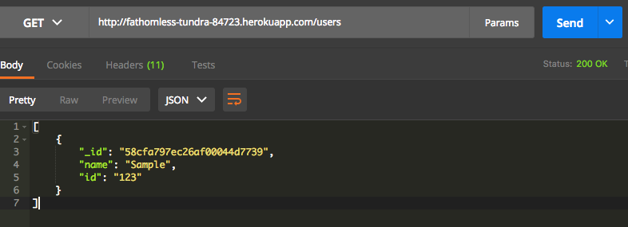
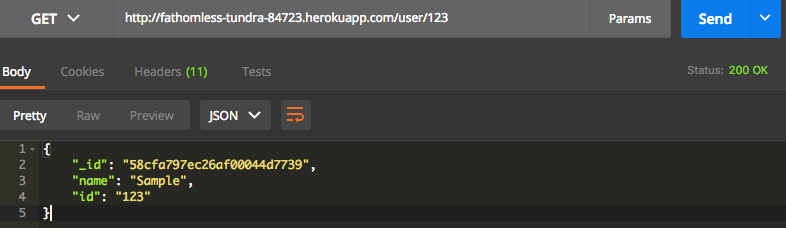
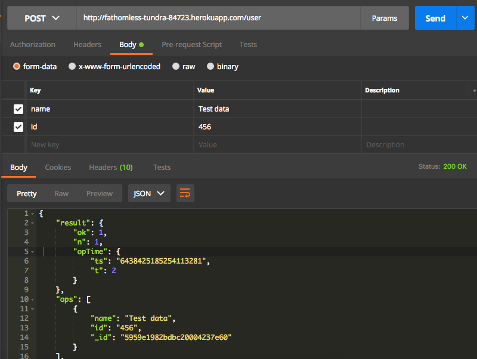
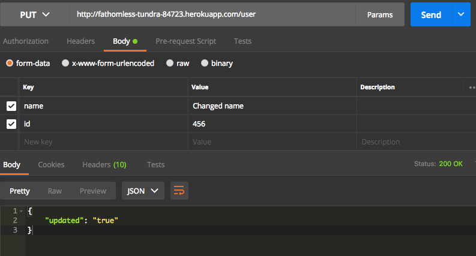
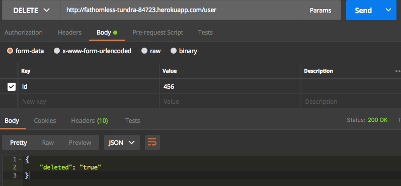

# nodejs-mongodb
Simple crud API using Node.js and MongoDB

- npm install
- npm start
- use Postman for the API

Paths:

| CRUD    | PATH       |
|---------|------------|
| GET     | /users     |
| GET     | /user/:id  |
| POST    | /user      |
| PUT     | /user      |
| DELETE  | /user      |

Demo: http://fathomless-tundra-84723.herokuapp.com
--

### GET /users

### GET /user/:id

### POST /user

### PUT /user

### DELETE /user

